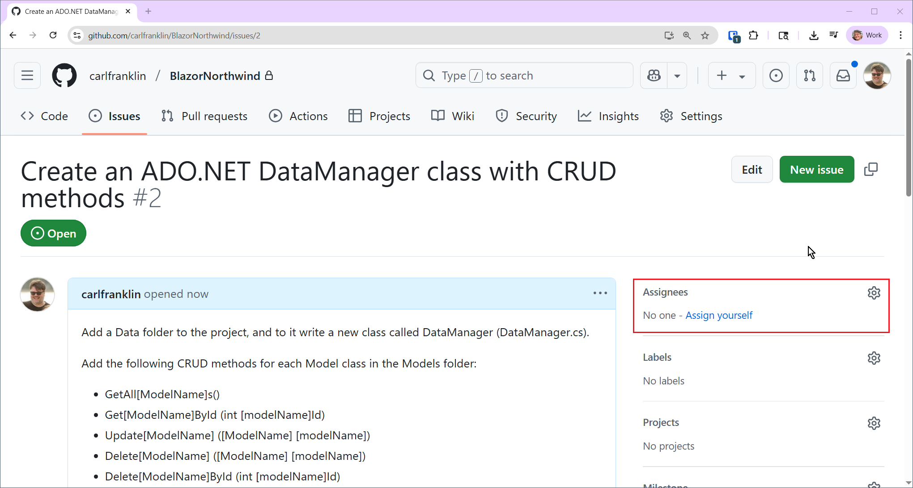
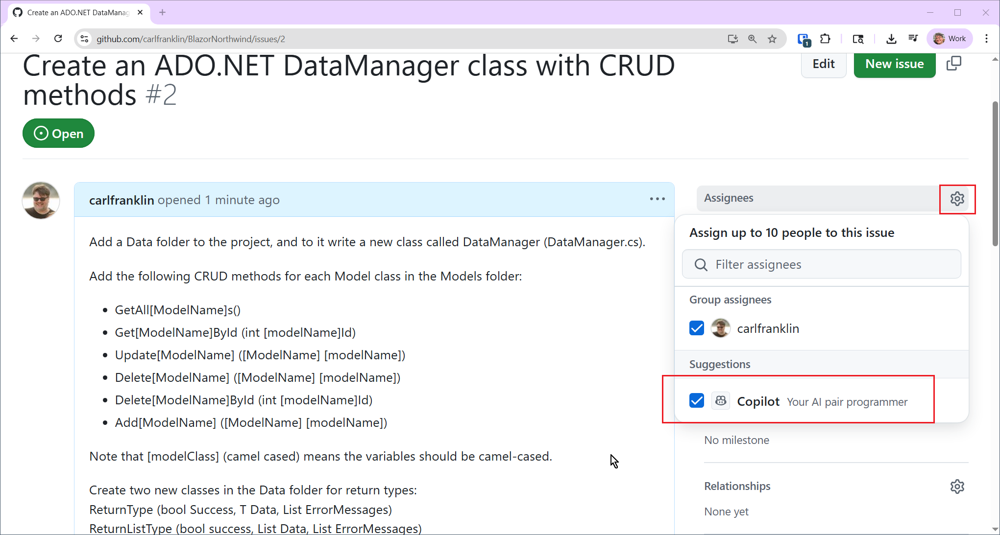
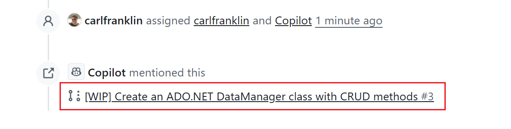
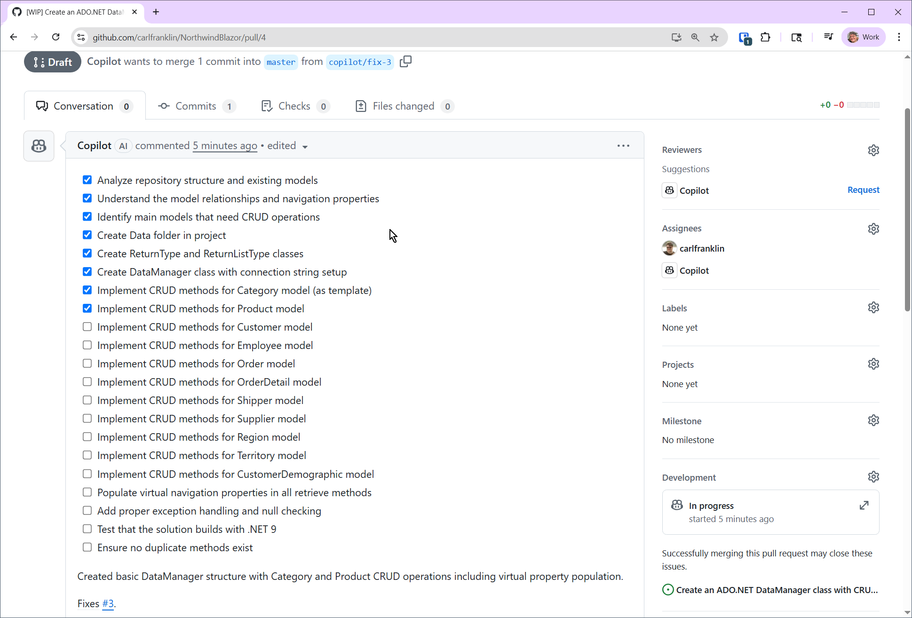
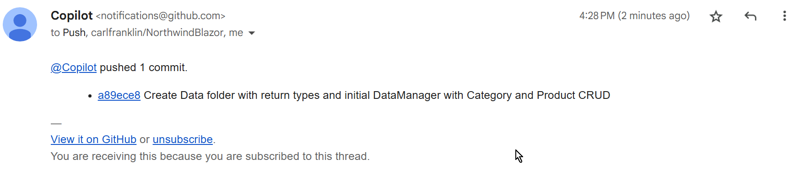
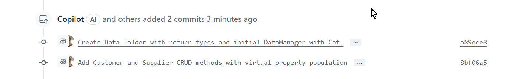
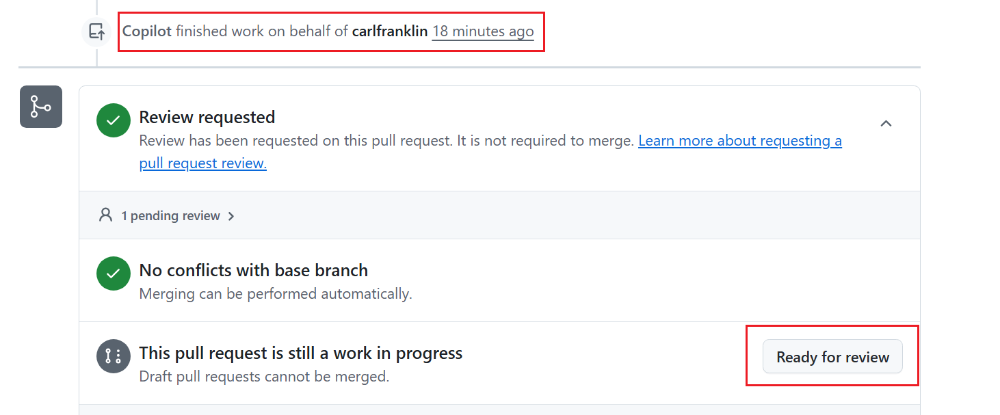
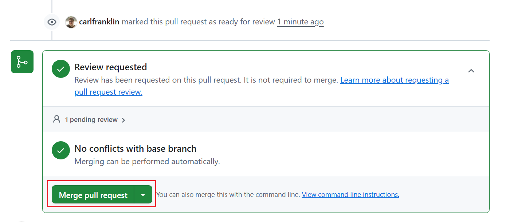
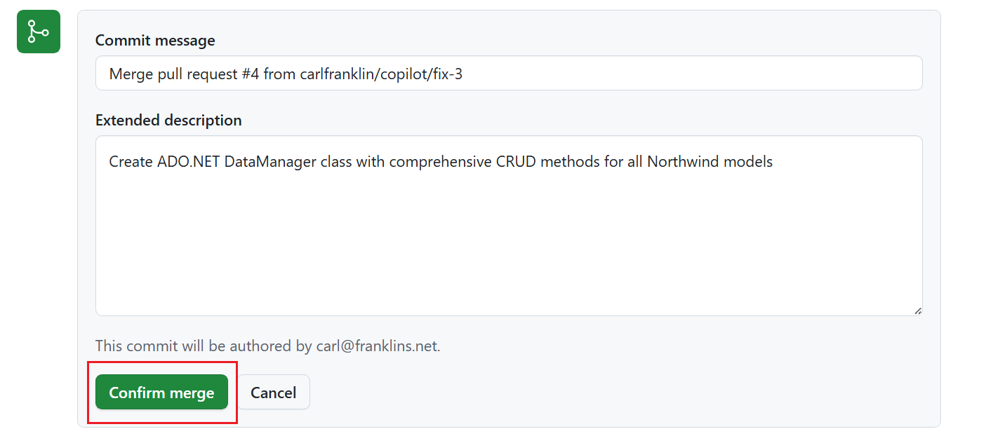
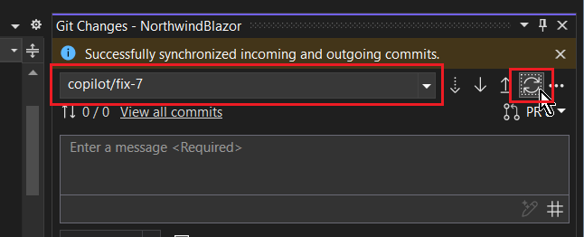

# Using the GitHub Copilot Coding Agent to build a Blazor Server app

In this workshop we will use the GitHub Copilot Coding Agent to help us build a forms-over-data application using the Northwind database.

There is a mindset you need to adopt when working with agents. 

> You are only limited by your imagination. Think big.

You can always revert to going small. An Agent is not a human. It does not have a limit on constructs it can hold in it's "mind."

## Install and configure Copilot

In order to use this feature in GitHub, you must have a **GitHub Copliot Pro +** account:

https://github.com/github-copilot/pro-plus

The cost is $39/month or $390/year.

Make sure the agent has access to your repos:

https://docs.github.com/en/copilot/managing-copilot/managing-copilot-as-an-individual-subscriber/managing-your-copilot-plan/managing-copilot-policies-as-an-individual-subscriber#enabling-or-disabling-copilot-coding-agent

## Create the Application

First, create a new .NET 9 Blazor Web App with global server interactivity called **NorthwindBlazor**.

Download the Northwind SQLite database at https://raw.githubusercontent.com/jpwhite3/northwind-SQLite3/main/dist/northwind.db and add it to your project.

Update *appsettings.json* with your connection string:

```json
{
  "Logging": {
    "LogLevel": {
      "Default": "Information",
      "Microsoft.AspNetCore": "Warning"
    }
  },
  "AllowedHosts": "*",
  "ConnectionStrings": {
    "NorthwindConnection": "Data Source=northwind.db;Version=3;"
  }
}
```

Add the following NuGet packages with these commands in the Visual Studio **Package Manager Console**:

```ps
Install-Package Microsoft.EntityFrameworkCore.Sqlite
Install-Package Microsoft.EntityFrameworkCore.Tools
```

You can use the following statements at the console if you don't have Visual Studio:

```bash
dotnet package add Microsoft.EntityFrameworkCore.Sqlite
dotnet package add Microsoft.EntityFrameworkCore.Tools
```

Build the project.

Scaffold the models to a Models folder by issuing this command in the **Package Manager Console**:

```ps
Scaffold-DbContext "Data Source=northwind.db" Microsoft.EntityFrameworkCore.Sqlite -OutputDir Models
```

You can use these equivalent commands at the console instead:

```bash
dotnet ef dbcontext scaffold "Data Source=northwind.db" Microsoft.EntityFrameworkCore.Sqlite --output-dir Models
```

Once it's done:

- Delete *NorthwindContext.cs* from the Models folder
- Remove *Weather.razor* and *Counter.razor* from the *Pages* folder as well as the NavLinks in the *NavMenu*.

Use this project to create a new private repo on GitHub.

## Interact with the Copilot Coding Agent

Now we are going to start interacting with the Coding Agent. We do this by creating issues and assigning them to Copilot.

> :thumbsup: NOTE: Your results may, and most likely will, be different than mine. That is because LLMs are non-deterministic.

You may be familiar with the term "System Prompt". This is a prompt that is sent with every request to an LLM. It's a place where you can specify general rules that should always be followed.

With the GitHub Copilot Coding Agent this is done with a markup file called *copilot-instructions.md*. So, let's add this file to our project.

These instructions come from Jeff Fritz's excellent post: [Level Up GitHub Copilot with copilot-instructions.md](https://copilotthatjawn.com/tips/copilot-instructions-md.md)

1. Create a *.github* folder in your project's root directory if it doesn't exist
2. Create a file named *copilot-instructions.md* inside the *.github* folder
3. Add it to source control (it works best when committed to your repository)
4. Include your project-specific instructions in Markdown format

*copilot-instructions.md*:

```
# BlazorNorthwind - Development Instructions

## Project Overview
This is a Blazor Web application that lets the user manage the Northwind database with forms-over-data.

## Technology Stack
- **Framework**: ASP.NET Core 9 Blazor Web App with global server interactivity. 
- **Database**: ADO.NET against a local SQLite database: northwind.db
- Do not downgrade to .NET 8. Continue using .NET 9.

## ADO.NET Policies
- Use the NorthwindConnection connection string in the appsettings.json file for all database connections.
- Use standard ADO.NET connections and commands with using statements.
- Check for null values in both incoming models and database results.
- Use try/catch exception handling around all database operations.

## Blazor EditForm Policies
- Use the EditForm component for all forms.
- Include validation attributes in the model classes for data annotations.
- Use the ValidationSummary component to display validation errors.
- Use the bootstrap grid system with bootstrap control styles. Make it look good!
- Wrap all select elements in div with the "list-group" class, but change the style of the selected div background color to a light gray.
- Always use the Virtualize component for all lists.
- Never show ID fields in the UI. Use the ID as a hidden field in the EditForm only.
- If an error is returned from a data manager, notify the user in an unobtrusive manner. Give the user the option to view the exception message(s).
```

Check in your changes.

Don't be afraid to open broad-reaching issues. Don't feel you have to create more small issues if it isn't warranted.

The first issue we will give the Agent is a fine example of a broad-reaching issue. We are going to tell the agent to create a DataManager with ADO.NET CRUD operations for every model.

Go to your repo at github.com and create a new Issue with this: 

Title: 

```
Create an ADO.NET DataManager class with CRUD methods
```

Description:

```
Add a Data folder to the project, and to it write a new class called DataManager (DataManager.cs).

Add the following CRUD methods for each Model class in the Models folder:

- GetAll[ModelName]s()
- Get[ModelName]ById (int [modelName]Id)
- Update[ModelName] ([ModelName] [modelName])
- Delete[ModelName] ([ModelName] [modelName])
- Delete[ModelName]ById (int [modelName]Id)
- Add[ModelName] ([ModelName] [modelName])

Note that [modelClass] (camel cased) means the variables should be camel-cased.

Create two new classes in the Data folder for return types:
ReturnType<T> (bool Success, T Data, List<string> ErrorMessages)
ReturnListType<T> (bool success, List<T> Data, List<string> ErrorMessages)

For each method, return the appropriate return type.

Do not downgrade to .NET 8. Use .NET 9

Implement these methods for EACH Model in the Models folder.

Fill in the virtual model property values in the DataManager.
For example, the OrderDetail model has an Order virtual property.
When retrieving an OrderDetail, look up the Order as well.

Do this for all the methods that retrieve data in the DataManager, not just the first three.

Fill in virtual List<T> model properties in the DataManager.
For example, the Customer model has a IEnumerable<Order> property called Orders.
When retrieving a Customer, look up the Orders as well.

Use the most efficient single SQL query to return data rather than executing multiple queries. That means doing multiple JOINs when there are virtual properties that need to be populated in GetX methods.

Do this for all the methods that retrieve data in the DataManager.

Do NOT create separate partial classes. Keep all methods in the DataManager class.

Ensure that there are no duplicate methods.

Add the DataManager as a service in Program.cs.

Make sure it builds
```

After creating, assign the issue to yourself.



Now assign it to Copilot.



Once Copilot has opened a PR, click on it to watch the progress.



It will take some time. Watch for the agent to create a checklist and then start checking things off:



Note that the last item in the list is **Test the implementation**. Now, since the database is local, the agent can't do end-to-end testing. That's ok. We will test it locally.

Once it has finished, you will get an email like this:



If you look at the PR, you'll see that Copilot has only finished some of the work. It seems to be breaking up the work into multiple PRs.



Let's wait until all of the work is complete.



Now click the **Ready for review** button.

Observe the changes in the PR, and merge it by clicking the **Merge pull request** button:



Confirm the merge.



Now pull the latest into your project and test it out.

Check out the *\Data\DataManager.cs* class. Here's just the top:

```c#
using System.Data;
using Microsoft.Data.SqlClient;
using NorthwindBlazor.Models;

namespace NorthwindBlazor.Data;

public class DataManager
{
    private readonly string _connectionString;

    public DataManager(string connectionString)
    {
        _connectionString = connectionString;
    }

    #region Category Methods

    public ReturnListType<Category> GetAllCategories()
    {
        var result = new ReturnListType<Category>();
        
        try
        {
            using var connection = new SqlConnection(_connectionString);
            connection.Open();
            
            var sql = "SELECT CategoryID, CategoryName, Description, Picture FROM Categories";
            using var command = new SqlCommand(sql, connection);
            using var reader = command.ExecuteReader();
            
            while (reader.Read())
            {
                var category = new Category
                {
                    CategoryId = reader.GetInt32("CategoryID"),
                    CategoryName = reader.IsDBNull("CategoryName") ? string.Empty : reader.GetString("CategoryName"),
                    Description = reader.IsDBNull("Description") ? null : reader.GetString("Description"),
                    Picture = reader.IsDBNull("Picture") ? null : (byte[])reader["Picture"]
                };
                
                result.Data.Add(category);
            }
            
            reader.Close();
            
            // Populate Products collection for each category
            foreach (var category in result.Data)
            {
                var productsResult = GetProductsByCategoryId(category.CategoryId);
                if (productsResult.Success)
                {
                    category.Products = productsResult.Data;
                }
            }
            
            result.Success = true;
        }
        catch (Exception ex)
        {
            result.Success = false;
            result.ErrorMessages.Add($"Error retrieving categories: {ex.Message}");
        }
        
        return result;
    }
...
```

This is exactly the way I would use ADO.NET to access a SQL database.

We are now ready to create Blazor pages!

### Configure UI for Blazor pages

First, add a new component to the *Components* folder that subclasses the `<InputText>` component to update the binding on every keystroke.

*InstantInputText.razor*:

```xml
@inherits Microsoft.AspNetCore.Components.Forms.InputText
<input @attributes="@AdditionalAttributes" class="@CssClass" 
       @bind="@CurrentValueAsString" @bind:event="oninput" />
```

Next, let's install Blazored.Modal

Official documentation and install instructions can be found at https://blazored.github.io/Modal/

Install the following package:

```
Install-Package Blazored.Modal
```

Register the service in *Program.cs*:

```c#
builder.Services.AddBlazoredModal();
```

You'll need this:

```c#
using Blazored.Modal;
```

Add the following to *_Imports.razor*:

```
@using Blazored.Modal
@using Blazored.Modal.Services
```

Add the `CascadingBlazoredModal` component to *Routes.razor*:

```xml
<CascadingBlazoredModal>
    <Router AppAssembly="typeof(Program).Assembly">
        ...
    </Router>
</CascadingBlazoredModal>
```

Before we go on, check in your changes.

### Add Blazor Pages

Here is the next issue:

Title:

```
Add an edit form Blazor page for each model
```

Description:

```
Create a Blazor page editor using the <EditForm> for each model where the user can filter, add, update, and delete records. 

Do not downgrade to .NET 8. Continue using .NET 9

For each list of models, show all and allow the user to filter with a text box. Use the InstantInputText component wherever you would use an InputText component. Use the bootstrap grid system with bootstrap control styles. Make it look good!

Wherever a virtual list is required, show it in a select.

Wrap the lists in <div class="list-group"> but change the style of the selected div background color to a very light gray

In general, show the complete list on the left, with a maximum height relative to the page height, and a vertical scrollbar. Show the edit fields on the right, and use labels to identify each field.

Use the <Virtualize> component to virtualize the lists of all models in each page.

Do not show the Id fields.

Implement validation on the edit forms using a validation summary.

If an error is returned from the DataManager, notify the user in an unobtrusive manner. Give the user the option to view the exception message(s).

If you need to add a model that requires more space than will fit on the screen, show a Modal dialog using Blazored.Modal, which is installed. 

Note that there is a <CascadingBlazoredModal> wrapped around the router in Routes.razor. Please do not remove it.

Add a NavLink for each page in the NavMenu.
```

> :point_up: **TIP**: If the Agent adds a PR to downgrade to .NET 8 just add a comment: "Do not downgrade to .NET 8. Continue with .NET 9"

The agent "completed" work several times. Each time I refreshed the branch in Visual Studio. In this case, my branch is **copilot/fix-7**. I could just drop that down from the **Git Changes** menu and hit refresh to test the code before accepting the changes:



As I went through the app and tested it. When the agent was done, I refreshed the branch to test it.

> Your experience will most likely be different from mine here. The main part of the application is done. Now I'm just looking for bugs and improvements. Of course, I could have gone on and on, but I merged the PR once it was all basically working.

These are the comments that I added during the final phase:

```
I'm getting errors loading all models on all forms. For example: "Error in GetAllCategories: Connection string keyword 'version' is not supported. For a possible alternative, see https://go.microsoft.com/fwlink/?linkid=2142181." Also, there is no Orders page. Please implement.
```

```
Please remove the Regions.razor page from the UI and also the related methods from the DataManager. We need to list the OrderDetail records in the Order record on the right. Add a button to Add an OrderDetail. That button should pop up a Modal to add the record. Make sure you have Delete and Edit buttons on each OrderDetail. Perhaps we should use a QuickGrid? Also, the Territories are not loading. I'm getting an error "Error in GetAllRegions: SQLite Error 1: 'no such table: Region'."
```

After the Agent addressed all of these, I had a real working application!

## What's Next?

You are only limited by your imagination. These prompts and issue descriptions just came out of my head. There is no official syntax or grammar requirements. Just explain what you want in plain English and be as detailed as you can. If a PR doesn't do what you wanted it to, close the issue and try again.

In the future, we will probably see a plethora of prompt libraries tuned by specialists to help you in even more ways than you can imagine. Stay tuned!


